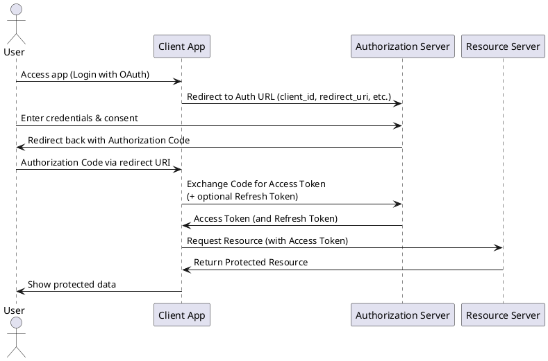

# OAuth Integration in .NET Core

## What is OAuth?

OAuth (Open Authorization) is an open standard for token-based authentication and authorization. It enables applications to securely access user data from other services without exposing login credentials. OAuth is commonly used for third-party authentication with services like Google, Facebook, and LinkedIn.

## 🚀 Flow Summary

The **Authorization Code Flow** is designed for apps that access resources on behalf of a user. It ensures secure token exchange without exposing sensitive credentials.

---

## 🔄 Sequence Diagram (PlantUML)

<details>
<summary>Click to expand PlantUML diagram source</summary>



---

## 📌 Components

* **User**: The person authorizing the application.
* **Client App**: Application requesting access (e.g., your website/app).
* **Authorization Server**: Service provider (e.g., Google Auth).
* **Resource Server**: The protected resource (API) the app wants to access.

---

## ✅ Benefits of Authorization Code Flow

* Secure token exchange.
* Supports refresh tokens for long-lived sessions.
* Keeps client secrets and access tokens safe.


## OAuth Providers

Some of the most commonly used OAuth providers include:

- **Google**
- **Facebook**
- **LinkedIn**
- **GitHub**
- **Microsoft**

## Prerequisites

- .NET Core SDK installed
- Visual Studio or any preferred IDE
- Developer accounts for OAuth providers (Google, Facebook, LinkedIn)
- API keys and secrets from each provider

## Step 1: Create a .NET Core Web Application

1. Open Visual Studio and create a new **ASP.NET Core Web Application**.
2. Choose **Web Application (Model-View-Controller)**.
3. Click **Create**.

## Step 2: Install Authentication Packages

Run the following command in the **Package Manager Console**:

```sh
Install-Package Microsoft.AspNetCore.Authentication.Google
Install-Package Microsoft.AspNetCore.Authentication.Facebook
Install-Package Microsoft.AspNetCore.Authentication.LinkedIn
```

Or using .NET CLI:

```sh
dotnet add package Microsoft.AspNetCore.Authentication.Google
dotnet add package Microsoft.AspNetCore.Authentication.Facebook
dotnet add package Microsoft.AspNetCore.Authentication.LinkedIn
```

## Step 3: Configure Authentication in Startup.cs (for .NET 5 and below)

Modify `Startup.cs` in the `ConfigureServices` method:

```csharp
public void ConfigureServices(IServiceCollection services)
{
    services.AddAuthentication()
        .AddGoogle(options =>
        {
            options.ClientId = "your_google_client_id";
            options.ClientSecret = "your_google_client_secret";
        })
        .AddFacebook(options =>
        {
            options.AppId = "your_facebook_app_id";
            options.AppSecret = "your_facebook_app_secret";
        })
        .AddLinkedIn(options =>
        {
            options.ClientId = "your_linkedin_client_id";
            options.ClientSecret = "your_linkedin_client_secret";
        });
}
```

In `Configure` method, enable authentication:

```csharp
public void Configure(IApplicationBuilder app, IWebHostEnvironment env)
{
    app.UseAuthentication();
    app.UseAuthorization();
    app.UseEndpoints(endpoints =>
    {
        endpoints.MapControllers();
    });
}
```

## Step 4: Configure Authentication in Program.cs (for .NET 6+)

Modify `Program.cs` to add authentication services:

```csharp
var builder = WebApplication.CreateBuilder(args);

builder.Services.AddAuthentication()
    .AddGoogle(options =>
    {
        options.ClientId = "your_google_client_id";
        options.ClientSecret = "your_google_client_secret";
    })
    .AddFacebook(options =>
    {
        options.AppId = "your_facebook_app_id";
        options.AppSecret = "your_facebook_app_secret";
    })
    .AddLinkedIn(options =>
    {
        options.ClientId = "your_linkedin_client_id";
        options.ClientSecret = "your_linkedin_client_secret";
    });

var app = builder.Build();
app.UseAuthentication();
app.UseAuthorization();
app.MapControllers();
app.Run();
```

## Step 5: Create Authentication Controller

Create a new **AuthController.cs** inside the `Controllers` folder.

```csharp
using Microsoft.AspNetCore.Authentication;
using Microsoft.AspNetCore.Authentication.Cookies;
using Microsoft.AspNetCore.Mvc;
using System.Threading.Tasks;

public class AuthController : Controller
{
    public IActionResult Login(string provider)
    {
        var redirectUrl = Url.Action("ExternalLoginCallback", "Auth");
        var properties = new AuthenticationProperties { RedirectUri = redirectUrl };
        return Challenge(properties, provider);
    }

    public async Task<IActionResult> ExternalLoginCallback()
    {
        var info = await HttpContext.AuthenticateAsync(CookieAuthenticationDefaults.AuthenticationScheme);
        return RedirectToAction("Index", "Home");
    }

    public async Task<IActionResult> Logout()
    {
        await HttpContext.SignOutAsync(CookieAuthenticationDefaults.AuthenticationScheme);
        return RedirectToAction("Index", "Home");
    }
}
```

## Step 6: Add Login Buttons to View

Modify `Views/Home/Index.cshtml`:

```html
<a href="/Auth/Login?provider=Google">Login with Google</a>
<a href="/Auth/Login?provider=Facebook">Login with Facebook</a>
<a href="/Auth/Login?provider=LinkedIn">Login with LinkedIn</a>
<a href="/Auth/Logout">Logout</a>
```

## Step 7: Run the Application

Run the application and navigate to `/Home/Index`. Click a login button to authenticate with an OAuth provider.

## Conclusion

You have successfully integrated OAuth authentication with Google, Facebook, and LinkedIn in your .NET Core application. You can extend this by handling user information, storing authentication tokens, and improving security.

### Further Enhancements
- Store user authentication details in a database.
- Add JWT authentication for API security.
- Implement role-based access control (RBAC).

 ## Connect with Me
- **LinkedIn**: [Suthahar Jeganathan](https://www.linkedin.com/in/jssuthahar/)
- **YouTube**: [MSDEVBUILD](https://www.youtube.com/@MSDEVBUILD)
- **YouTube Tamil**: [MSDEVBUILD TAMIL](https://www.youtube.com/@MSDEVBUILDTamil)
- **Blog**: [Blog](https://www.msdevbuild.com/)
- **Follow Whatsapp**: [Whatsapp](https://www.whatsapp.com/channel/0029Va5j2rHEFeXcTlUhQB0J)
